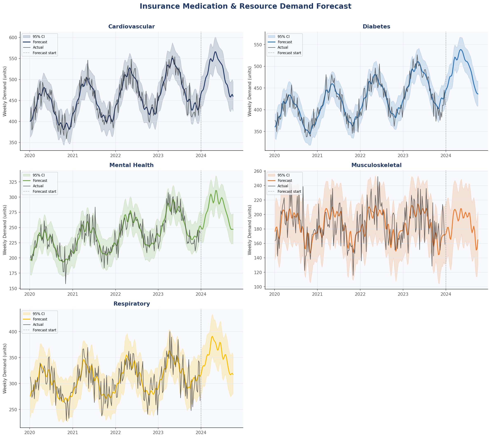
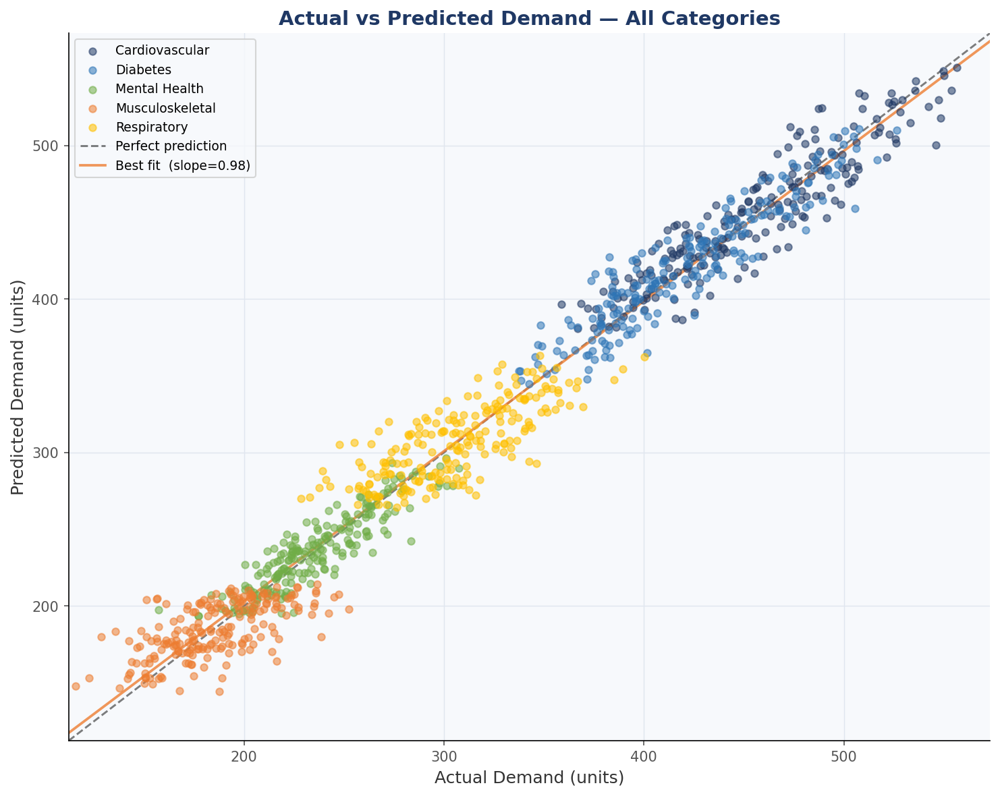
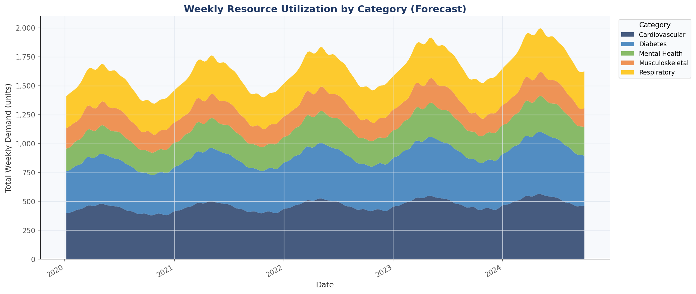
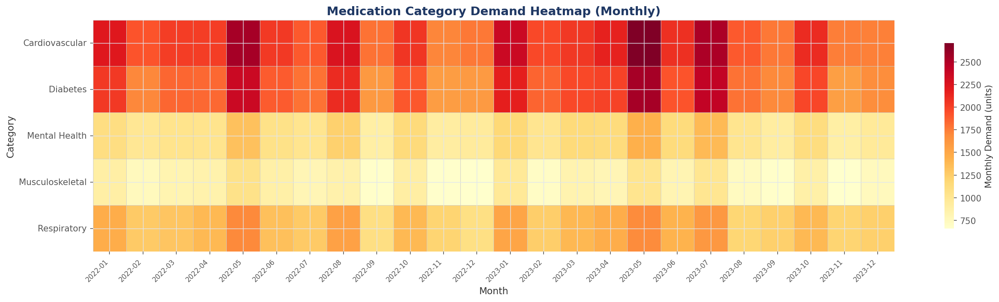

# Insurance Demand Forecasting System

A time-series forecasting system that predicts weekly medication and resource demand across five insurance-relevant pharmaceutical categories using Facebook Prophet. Achieves **average MAPE of ~6.7%** on a held-out test set.

---

## Dataset

**Source:** [Pharma Sales Data — Kaggle](https://www.kaggle.com/datasets/milanzdravkovic/pharma-sales-data)

The dataset contains real weekly sales records of pharmaceutical products across drug category codes (M01AB, M01AE, N02BA, N02BE, N05B, N05C, R03, R06). This project maps those codes to five insurance-relevant categories:

| Kaggle Code | Category |
|---|---|
| M01AB, M01AE | Musculoskeletal |
| N02BA, N02BE | Cardiovascular |
| N05B, N05C | Mental Health |
| R03 | Respiratory |
| R06 | Diabetes |

> If you do not have Kaggle access, run with `--synthetic` to use a generated dataset instead (see Usage below).

---

## Results

| Category | MAPE (%) | MAE | RMSE |
|---|---|---|---|
| Cardiovascular | 4.16 | 17.81 | 19.83 |
| Diabetes | 5.56 | 21.77 | 25.67 |
| Mental Health | 4.50 | 10.12 | 11.87 |
| Musculoskeletal | 9.56 | 17.81 | 22.75 |
| Respiratory | 9.48 | 26.40 | 31.53 |
| **Average** | **6.65%** | | |

---

## Visualizations

| Chart | Description |
|---|---|
| `1_forecast_over_time.png` | Per-category forecast with 95% confidence band |
| `2_actual_vs_predicted.png` | Scatter plot of actual vs predicted demand with line of best fit |
| `3_resource_utilization.png` | Stacked area chart of total weekly demand across categories |
| `4_category_heatmap.png` | Monthly demand heatmap across all categories |






---

## Project Structure

```
insurance-demand-forecasting/
├── data/
│   └── salesweekly.csv            # Download from Kaggle (not tracked in git)
├── src/
│   ├── generate_data.py           # Data loading and preprocessing
│   ├── forecast.py                # Prophet model training and evaluation
│   └── visualize.py               # Dashboard chart generation
├── outputs/
│   ├── forecasts.csv              # Full forecast output per category
│   └── metrics.csv                # Evaluation metrics per category
├── visuals/
│   ├── 1_forecast_over_time.png
│   ├── 2_actual_vs_predicted.png
│   ├── 3_resource_utilization.png
│   └── 4_category_heatmap.png
├── run_pipeline.py                # Single entry point
├── requirements.txt
└── README.md
```

---

## Setup and Usage

### 1. Clone the repository

```bash
git clone https://github.com/asleshadesetty/insurance-demand-forecasting.git
cd insurance-demand-forecasting
```

### 2. Install dependencies

```bash
pip install -r requirements.txt
```

> Prophet requires `pystan`. If installation fails, try:
> ```bash
> pip install pystan==2.19.1.1
> pip install prophet
> ```

### 3. Download the dataset

Go to: https://www.kaggle.com/datasets/milanzdravkovic/pharma-sales-data

Download `salesweekly.csv` and place it in the `data/` folder.

### 4. Run the full pipeline

```bash
python run_pipeline.py
```

This runs all three steps in sequence:
- Preprocesses the Kaggle dataset and saves to `data/insurance_demand.csv`
- Trains Prophet models and saves forecasts + metrics to `outputs/`
- Generates all four charts in `visuals/`

### 5. No Kaggle access? Use synthetic data

```bash
python src/generate_data.py --synthetic
python src/forecast.py
python src/visualize.py
```

---

## Methodology

### Data Preprocessing
The raw Kaggle dataset contains daily/weekly pharmaceutical sales by ATC drug code. This pipeline:
- Selects 8 drug codes relevant to insurance demand categories
- Aggregates combined codes into 5 categories
- Resamples to weekly frequency

### Model
Facebook Prophet was chosen for:
- Native support for multiple seasonality components
- Robustness to missing data and outliers
- Uncertainty quantification via confidence intervals
- Interpretable trend and seasonality decomposition

Key Prophet parameters:
```python
Prophet(
    yearly_seasonality=True,
    weekly_seasonality=True,
    seasonality_mode="multiplicative",
    changepoint_prior_scale=0.05,
    interval_width=0.95,
)
```

### Evaluation
Models are evaluated on the last **12 weeks** of historical data (held-out test set) using:
- **MAPE**: primary accuracy metric
- **MAE**: average absolute error in demand units
- **RMSE**: penalises larger errors more heavily

---

## Applications

This forecasting framework is applicable to:
- **Pharmaceutical procurement**: reduce overstock and stockout risk
- **Hospital resource planning**: anticipate staffing and supply needs
- **Insurance reserve modeling**: improve actuarial demand estimates

---

## Tech Stack

| Tool | Purpose |
|---|---|
| Python 3.10+ | Core language |
| Facebook Prophet | Time-series forecasting |
| Pandas / NumPy | Data manipulation |
| Matplotlib / Seaborn | Visualization |
| Scikit-learn | Evaluation metrics |

---

## Author

**Jagdish Aslesha Desetty**
Data Science & Visualization Engineer
[linkedin.com/in/asleshadesetty](https://linkedin.com/in/asleshadesetty) | asleshadj1005@gmail.com
